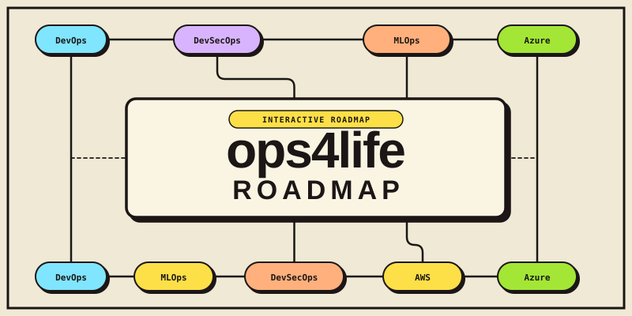

# ops4life Roadmaps

Interactive roadmaps for modern engineering practices.

## Available Roadmaps

All roadmaps live behind a single page — pick a track from the in-app track picker:

- **DevOps** — CI/CD, containers, cloud, observability, and more
- **DevSecOps** — security integrated into the DevOps lifecycle
- **MLOps** — machine learning operations and productionizing ML
- **DevOps to MLOps** — a 90-day curriculum for DevOps engineers moving into MLOps
- **SAP-C02** — AWS Solutions Architect Professional certification prep
- **AZ-104** — Azure Administrator Associate certification prep

Each track's data lives in its own file under [`tracks/`](tracks/).

## Live Site

Visit [roadmap.ops4life.com](https://roadmap.ops4life.com) to explore all roadmaps.

## Contributing

Found an error or want to suggest a topic? Open an issue or pull request — contributions are welcome.
